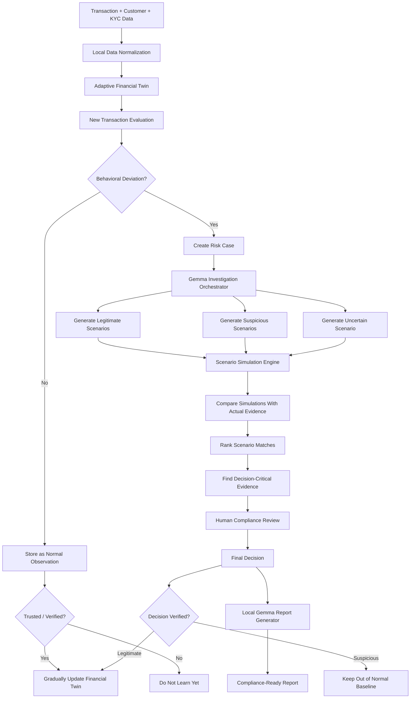
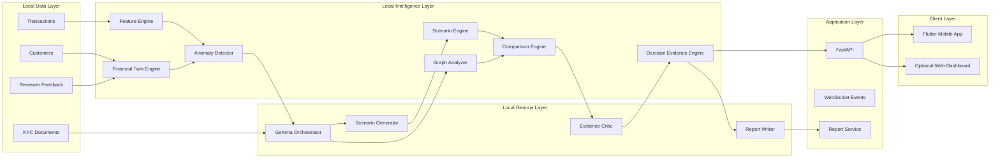

# Pyxis
## Gemma-Powered Adaptive Financial Compliance & Risk Triage Platform

> **Track:** Gemma Financial Compliance & Risk Triage  
> **Core idea:** Learn each customer's normal financial behavior, detect deviations, simulate competing legitimate and suspicious explanations with Gemma, compare those scenarios against the actual evidence, identify what information would change the decision, and generate an auditable compliance report — entirely within a local or on-premise environment.

---

# 1. Executive Summary

Pyxis is a privacy-first financial compliance platform designed for banks, fintechs, and regulated financial institutions.

Traditional transaction-monitoring systems usually rely on fixed rules such as:

- transaction amount greater than a threshold,
- high transaction frequency,
- transfer to a new beneficiary,
- unusual country,
- rapid movement of received funds.

These systems are useful, but they can generate large numbers of false positives because a transaction that is unusual for one customer may be completely normal for another.

Pyxis takes a more personalized approach.

For every customer, the system maintains an **Adaptive Financial Twin** representing the customer's trusted financial behavior. When a transaction deviates significantly from this profile, the transaction is not immediately classified as fraud or suspicious activity.

Instead, a locally running Gemma model:

1. studies the customer's financial context,
2. generates multiple possible explanations,
3. creates both legitimate and suspicious hypotheses,
4. invokes deterministic local analysis tools,
5. compares each hypothesis with the real transaction evidence,
6. ranks the most plausible scenarios,
7. identifies the exact missing evidence that could change the conclusion,
8. supports a human compliance officer in the final decision,
9. generates an evidence-backed compliance report.

The system therefore follows:

```text
LEARN → DETECT → SIMULATE → COMPARE → VERIFY → DECIDE → REPORT
```

The key differentiator is that Pyxis does not simply ask:

> "Is this transaction abnormal?"

It asks:

> "Which legitimate or suspicious scenario best explains what actually happened, and what evidence would change our decision?"

---

# 2. Core Hackathon Constraint

## 2.1 Gemma must be the AI foundation

All generative reasoning must use locally deployed Gemma models.

No customer transaction data, KYC documents, financial records, generated investigation context, or compliance reports should be sent to external hosted LLM APIs.

Gemma is used for:

- contextual financial reasoning,
- hypothesis generation,
- scenario construction,
- evidence interpretation,
- contradiction detection,
- investigation planning,
- explanation generation,
- reviewer question answering,
- compliance report generation.

Deterministic calculations such as statistics, transaction aggregation, graph traversal, similarity calculations, and rule execution are performed by local code and can be invoked as tools by Gemma.

This is important because Gemma should reason over trusted computed evidence rather than invent numerical facts.

---

# 3. Privacy-First Deployment Principle

Pyxis should be presented as a **local-first / on-premise compliance intelligence platform**.

```text
Bank Data
    |
    v
Local Database
    |
    v
Local Analysis Engine
    |
    v
Local Gemma Runtime
    |
    v
Compliance API
    |
    +----------------------+
    |                      |
    v                      v
Mobile Reviewer App    Local Web Dashboard
```

Sensitive data remains inside the institution-controlled environment.

For the hackathon, this can run on:

- a developer laptop,
- a local workstation,
- a local GPU server,
- or a private LAN machine.

The Flutter mobile app communicates with the local backend over the same secure network.

## Recommended hackathon deployment

```text
Laptop / Local Server
├── SQLite Database File
├── FastAPI Backend
├── Gemma Runtime
├── Adaptive Twin Engine
├── Scenario Simulation Engine
├── Report Generator
└── Local REST / WebSocket API
          |
          | Local Wi-Fi / LAN
          v
      Flutter Mobile App
```

---

# 4. High-Level Problem Statement

Financial institutions process enormous volumes of transactions and customer records.

Compliance teams must determine whether unusual activity represents:

- legitimate changes in customer behavior,
- business growth,
- large purchases,
- supplier payments,
- international expansion,
- unusual but explainable personal activity,
- fraud,
- account takeover,
- transaction layering,
- money mule behavior,
- structuring,
- or another compliance risk.

A fixed rule can detect that something is unusual.

It cannot always explain **why** the behavior happened.

Pyxis solves this by maintaining a personalized behavioral model and evaluating multiple competing explanations.

---

# 5. Main Inputs

## 5.1 Transaction Data

Example fields:

```json
{
  "transaction_id": "TXN-100234",
  "customer_id": "CUST-001",
  "source_account": "ACC-100",
  "destination_account": "ACC-750",
  "amount": 1200000,
  "currency": "INR",
  "transaction_type": "BANK_TRANSFER",
  "direction": "CREDIT",
  "timestamp": "2026-07-18T10:02:34",
  "channel": "MOBILE_BANKING",
  "country": "UAE",
  "beneficiary_id": "BEN-450",
  "device_id": "DEV-20",
  "status": "SUCCESS"
}
```

## 5.2 Customer Profile

```json
{
  "customer_id": "CUST-001",
  "customer_type": "BUSINESS",
  "declared_business": "Textile Retail",
  "declared_monthly_turnover": 700000,
  "country": "India",
  "account_age_months": 36,
  "kyc_status": "VERIFIED"
}
```

## 5.3 Historical Transaction Behavior

Examples:

- average transaction value,
- median transaction value,
- normal amount range,
- transaction frequency,
- usual beneficiaries,
- typical active hours,
- common transaction channels,
- normal geographic regions,
- monthly money flow,
- recurring transaction patterns.

## 5.4 KYC and Onboarding Documents

Examples:

- customer onboarding forms,
- identity documents,
- business registration,
- tax documents,
- income records,
- invoices,
- supplier records,
- bank statements,
- proof of address.

## 5.5 Reviewer Feedback

Examples:

```text
Confirmed Legitimate
Confirmed Suspicious
False Positive
Needs More Evidence
Escalated
Closed
```

Only trusted reviewer outcomes should influence future adaptive learning.

---

# 6. Main Outputs

The system produces:

## 6.1 Personalized Anomaly Assessment

```text
Initial Anomaly Score: 87 / 100
Deviation Level: Severe
```

## 6.2 Competing Scenario Analysis

```text
Legitimate Business Payment     68%
Transaction Layering            82%
Account Takeover                21%
Insufficient Evidence           55%
```

## 6.3 Evidence For and Against Each Scenario

```text
SUPPORTING SUSPICION
- Large incoming transaction
- Rapid fund redistribution
- Five new beneficiaries

SUPPORTING LEGITIMATE ACTIVITY
- Valid invoice exists
- Sender matches invoice
- International trading activity was recently declared
```

## 6.4 Decision-Critical Evidence

```text
Most important unresolved question:

Are the five receiving accounts verified business suppliers?
```

## 6.5 Recommended Investigation Actions

```text
1. Verify beneficiary relationships.
2. Request supplier invoices.
3. Confirm source of funds.
4. Review previous linked-account activity.
```

## 6.6 Final Compliance Report

The final report can contain:

- case metadata,
- customer profile,
- transaction timeline,
- detected deviations,
- scenario analysis,
- evidence matrix,
- decision-critical evidence,
- reviewer actions,
- final disposition,
- model-generated summary,
- audit trail.

---

# 7. Core Innovation

## Adaptive Counterfactual Financial Twin

The product combines four ideas.

### 7.1 Adaptive Financial Twin

Each customer has a continuously updated representation of trusted normal behavior.

### 7.2 Competing Scenario Generation

Gemma generates multiple possible explanations instead of immediately assigning a binary label.

### 7.3 Evidence-Based Scenario Comparison

Local deterministic code evaluates how closely each simulated scenario matches actual evidence.

### 7.4 Decision-Critical Evidence Discovery

The system identifies the missing fact that would most strongly separate a legitimate explanation from a suspicious explanation.

---

# 8. End-to-End Workflow



---

# 9. Adaptive Financial Twin

## 9.1 Purpose

The Financial Twin represents what is currently normal for one specific customer.

It should not be a separate fully fine-tuned Gemma model for every customer.

Instead, it should be a structured customer-specific state that is passed to Gemma as investigation context.

Example:

```json
{
  "customer_id": "CUST-001",
  "amount_profile": {
    "median": 42000,
    "p95": 125000,
    "trusted_range": [10000, 150000]
  },
  "velocity_profile": {
    "average_transactions_per_day": 3.2,
    "maximum_normal_hourly_count": 4
  },
  "beneficiary_profile": {
    "known_beneficiaries": 8,
    "known_beneficiary_ratio": 0.92
  },
  "geography_profile": {
    "common_countries": ["India"],
    "international_transfer_frequency": 0.03
  },
  "time_profile": {
    "usual_start_hour": 8,
    "usual_end_hour": 21
  },
  "business_profile": {
    "business_type": "Textile Retail",
    "expected_monthly_turnover": 700000
  }
}
```

---

# 10. Trust-Gated Adaptive Learning

A major risk in adaptive systems is behavioral poisoning.

If every new transaction is automatically treated as normal, slowly changing suspicious behavior could eventually become part of the baseline.

Example:

```text
January:
Small abnormal behavior
        |
System learns it automatically
        v

February:
Slightly more abnormal
        |
System learns again
        v

March:
Clearly suspicious behavior
        |
System now considers it normal
```

Pyxis prevents this with **Trust-Gated Adaptive Learning**.

## Update the Financial Twin only when:

- the transaction is low-risk and consistent over time,
- the activity has been confirmed legitimate,
- a compliance reviewer has cleared the alert,
- supporting evidence has been verified,
- the behavioral change is gradual and sufficiently supported.

## Do not update the normal baseline when:

- the transaction is currently flagged,
- the case is unresolved,
- the transaction was confirmed suspicious,
- required evidence is missing,
- the transaction is part of an active investigation.

---

# 11. Initial Deviation Detection

The first stage should identify whether a transaction deserves deeper Gemma analysis.

This stage can combine:

## 11.1 Personalized Statistical Deviations

Examples:

```text
amount_z_score
amount_percentile
transaction_velocity
time_since_previous_transaction
new_beneficiary_ratio
geographic_novelty
device_novelty
monthly_flow_deviation
```

## 11.2 Explainable Rules

Examples:

```text
Amount > Customer P95 × multiplier
Many transfers within a short time
High-value transfer to a new beneficiary
Large incoming funds immediately redistributed
Sudden international transaction
Transaction behavior conflicts with business profile
```

## 11.3 Optional Local ML

Possible models:

- Isolation Forest,
- Local Outlier Factor,
- One-Class SVM,
- Autoencoder.

For a hackathon, Isolation Forest is sufficient as an optional secondary signal.

Gemma remains the reasoning and investigation layer.

---

# 12. Gemma Investigation Orchestrator

Gemma should not receive raw unstructured database dumps.

The backend should first construct a compact evidence package.

Example:

```json
{
  "case_id": "CASE-1001",
  "current_transaction": {},
  "customer_twin": {},
  "recent_transaction_summary": {},
  "detected_deviations": [],
  "kyc_summary": {},
  "document_evidence": [],
  "relationship_summary": {}
}
```

Gemma receives this structured context and performs the following tasks:

1. explain which observations require investigation,
2. generate plausible legitimate scenarios,
3. generate plausible suspicious scenarios,
4. state the expected evidence for each scenario,
5. request deterministic local tools when calculations are required,
6. identify contradictions,
7. return structured JSON.

---

# 13. Gemma Roles

The system can use one locally hosted Gemma model with multiple role prompts.

## Role 1: Investigation Orchestrator

Purpose:

- understand the case,
- decide which analyses are required,
- generate investigation steps.

## Role 2: Scenario Generator

Purpose:

- generate legitimate explanations,
- generate suspicious explanations,
- generate uncertain explanations.

## Role 3: Evidence Critic

Purpose:

- challenge the strongest hypothesis,
- identify unsupported conclusions,
- detect contradictions.

## Role 4: Decision-Critical Evidence Analyst

Purpose:

- identify which missing fact would most affect the final classification.

## Role 5: Compliance Report Writer

Purpose:

- transform validated structured evidence into a professional report.

The same model can be reused with different system prompts.

This avoids using an external second LLM.

---

# 14. Scenario Categories

The system should avoid only two labels such as GOOD and BAD.

Use three broad groups.

## 14.1 Legitimate

Examples:

- genuine business payment,
- business expansion,
- property purchase,
- loan disbursement,
- supplier settlement,
- family transfer,
- investment liquidation.

## 14.2 Suspicious

Examples:

- transaction layering,
- structuring,
- money mule behavior,
- account takeover,
- unusual pass-through activity,
- unexplained high-risk counterparties,
- possible synthetic business activity.

## 14.3 Uncertain

Examples:

- missing source-of-funds evidence,
- incomplete customer profile,
- ambiguous beneficiary relationships,
- insufficient historical data,
- conflicting documentation.

---

# 15. Scenario Object Format

Gemma should return structured scenarios.

```json
{
  "scenario_id": "SCN-001",
  "category": "SUSPICIOUS",
  "name": "Transaction Layering",
  "description": "Large incoming funds followed by rapid redistribution.",
  "expected_signals": [
    {
      "signal": "large_incoming_transaction",
      "weight": 0.20
    },
    {
      "signal": "rapid_outgoing_transfers",
      "weight": 0.25
    },
    {
      "signal": "new_beneficiaries",
      "weight": 0.25
    },
    {
      "signal": "weak_business_explanation",
      "weight": 0.30
    }
  ]
}
```

---

# 16. Scenario Simulation Engine

Gemma defines what evidence should be expected under each scenario.

Local code performs the actual comparison.

Example:

## Scenario: Legitimate Business Payment

Expected:

```text
Invoice exists
Sender matches invoice
Amount approximately matches invoice
Transaction aligns with business activity
Beneficiaries are known suppliers
```

## Scenario: Transaction Layering

Expected:

```text
Large incoming transaction
Immediate redistribution
Multiple beneficiaries
New or weakly connected beneficiaries
Short transfer intervals
Weak commercial explanation
```

The actual case is evaluated against each expected pattern.

---

# 17. Scenario Match Scoring

A simple hackathon-friendly approach:

```text
Scenario Match =
Sum of weights for matched signals
----------------------------------
Sum of all scenario signal weights
```

Example:

```text
Transaction Layering

Large incoming transaction       MATCH     0.20
Rapid redistribution             MATCH     0.25
New beneficiaries                MATCH     0.25
Weak business explanation        PARTIAL   0.15 / 0.30

Total match = 0.85
Scenario Match = 85%
```

For partial evidence, values can be:

```text
MATCH       = 1.0
PARTIAL     = 0.5
UNKNOWN     = 0.0 with uncertainty flag
CONTRADICT  = negative penalty
```

The exact scoring system should remain transparent and auditable.

---

# 18. Decision-Critical Evidence Engine

This is one of the strongest differentiators.

Suppose:

```text
Legitimate Business Payment   72%
Transaction Layering          84%
```

The system compares the evidence expectations of the two leading scenarios.

Both may explain:

- large transaction,
- foreign payment,
- unusual amount.

The main difference may be:

```text
Are the receiving accounts genuine suppliers?
```

The system therefore produces:

```json
{
  "decision_critical_evidence": {
    "question": "Are the five receiving accounts verified suppliers?",
    "why_it_matters": "Verified supplier relationships strongly support the legitimate business scenario.",
    "recommended_action": "Request supplier invoices and relationship records."
  }
}
```

This converts AI reasoning into an actionable investigation task.

---

# 19. Counterfactual Analysis

Pyxis can show how additional evidence may affect the case.

Example:

```text
Current Risk: 84

If invoice is verified:
84 → 72

If sender is verified customer:
72 → 61

If beneficiaries are verified suppliers:
61 → 28
```

These should be clearly presented as **scenario-based estimates**, not guaranteed predictions.

The purpose is to answer:

> "What information matters most before making a decision?"

---

# 20. Human-in-the-Loop Decision

The compliance officer remains the final decision-maker.

Available actions:

```text
Approve / Clear
Request More Evidence
Escalate
Mark Suspicious
Close Case
```

Every decision should be recorded.

Example audit event:

```json
{
  "case_id": "CASE-1001",
  "reviewer_id": "OFFICER-12",
  "action": "REQUEST_MORE_EVIDENCE",
  "reason": "Beneficiary relationship unresolved",
  "timestamp": "2026-07-18T14:25:00"
}
```

---

# 21. Local Report Generation

The report generator must also use the local Gemma deployment.

Do not send data to an external LLM.

The reporting pipeline should be:

```text
Validated Case Evidence
        |
        v
Structured Report JSON
        |
        v
Local Gemma Report Writer
        |
        v
Human-Readable Narrative
        |
        v
Template Renderer
        |
        v
PDF / HTML Report
```

Gemma should generate narrative text only from verified structured evidence.

The final renderer should deterministically insert:

- customer ID,
- case ID,
- timestamps,
- risk scores,
- transaction IDs,
- reviewer decisions,
- evidence references.

---

# 22. System Architecture



---

# 23. Recommended Local AI Architecture

## Option A — Recommended for Hackathon

Run Gemma on the laptop/server.

```text
Flutter Mobile App
       |
       v
FastAPI
       |
       v
Gemma Service
       |
       v
Local Gemma Model
```

Advantages:

- easier to implement,
- model is loaded once,
- mobile device does not require high RAM,
- banking data remains inside the local machine/network,
- easier to integrate SQLite and local analytics,
- easier to demo.

## Option B — On-Device Mobile Gemma

For a future fully edge-native version, a smaller Gemma model optimized for mobile can be run directly on supported devices.

This is a stretch goal rather than the recommended hackathon architecture.

---

# 24. Recommended Gemma Strategy

Because hardware availability varies, keep the model layer configurable.

## Development / Hackathon

Choose a Gemma checkpoint that fits available hardware.

Possible local runtimes include:

- Hugging Face Transformers,
- llama.cpp for quantized local inference,
- LiteRT-LM for supported edge deployments.

## Recommended architecture rule

```text
app code
   |
GemmaProvider Interface
   |
   +-- TransformersGemmaProvider
   +-- LlamaCppGemmaProvider
   +-- LiteRTGemmaProvider
```

This prevents the entire application from depending on one inference runtime.

---

# 25. Tech Stack

## 25.1 Mobile Application

| Component | Technology |
|---|---|
| Framework | Flutter |
| Language | Dart |
| Architecture | Feature-first + MVVM-inspired layers |
| State Management | Riverpod or Bloc |
| Networking | Dio |
| Local Cache | SQLite / Drift |
| Secure Tokens | flutter_secure_storage |
| Charts | fl_chart |
| Graph Visualization | CustomPainter or graph package |
| PDF Viewing | Local PDF viewer package |
| Navigation | go_router |
| Real-time Updates | WebSocket |

## 25.2 Backend

| Component | Technology |
|---|---|
| API Framework | FastAPI |
| Language | Python |
| Validation | Pydantic |
| ORM | SQLAlchemy |
| Database Migrations | Alembic |
| Async Tasks | FastAPI background tasks or local worker |
| Real-time | WebSocket |
| Report Rendering | Jinja2 + WeasyPrint / ReportLab |
| Testing | Pytest |

## 25.3 Database

| Data | Technology |
|---|---|
| Primary Relational Data | SQLite |
| Vector Search | FAISS locally |
| Document Metadata | SQLite |
| Audit Logs | SQLite append-only tables |

A separate cloud vector database is not required.

## 25.4 AI / ML

| Purpose | Technology |
|---|---|
| Main Reasoning Model | Gemma |
| Local Runtime | Hugging Face / llama.cpp |
| Edge Runtime Option | LiteRT-LM |
| Numerical Analysis | NumPy / Pandas |
| Anomaly Detection | scikit-learn |
| Embeddings | Local embedding model if required |
| Vector Retrieval | FAISS |
| Graph Analysis | NetworkX |

## 25.5 Document Processing

| Purpose | Technology |
|---|---|
| PDF Parsing | PyMuPDF |
| Tabular Extraction | pdfplumber |
| OCR when required | Local OCR engine |
| Image Preprocessing | OpenCV |
| Structured Extraction | Gemma + validation schema |

## 25.6 Development Tools

```text
Git
GitHub
Postman
VS Code
```

---

# 26. Repository Folder Structure

```text
pyxis/
│
├── README.md
├── LICENSE
├── .gitignore
├── .env.example
├── pyproject.toml
├── requirements.txt
│
├── docs/
│   ├── architecture.md
│   ├── data-flow.md
│   ├── gemma-design.md
│   ├── scenario-engine.md
│   ├── api-contracts.md
│   ├── security.md
│   └── demo-script.md
│
├── backend/
│   ├── app/
│   │   ├── main.py
│   │   │
│   │   ├── core/
│   │   │   ├── config.py
│   │   │   ├── security.py
│   │   │   ├── logging.py
│   │   │   └── constants.py
│   │   │
│   │   ├── api/
│   │   │   ├── dependencies.py
│   │   │   └── v1/
│   │   │       ├── router.py
│   │   │       ├── transactions.py
│   │   │       ├── customers.py
│   │   │       ├── cases.py
│   │   │       ├── investigations.py
│   │   │       ├── documents.py
│   │   │       ├── reports.py
│   │   │       └── websocket.py
│   │   │
│   │   ├── models/
│   │   │   ├── customer.py
│   │   │   ├── account.py
│   │   │   ├── transaction.py
│   │   │   ├── beneficiary.py
│   │   │   ├── document.py
│   │   │   ├── financial_twin.py
│   │   │   ├── risk_case.py
│   │   │   ├── scenario.py
│   │   │   ├── evidence.py
│   │   │   └── audit_log.py
│   │   │
│   │   ├── schemas/
│   │   │   ├── customer.py
│   │   │   ├── transaction.py
│   │   │   ├── case.py
│   │   │   ├── scenario.py
│   │   │   ├── evidence.py
│   │   │   └── report.py
│   │   │
│   │   ├── repositories/
│   │   │   ├── customer_repository.py
│   │   │   ├── transaction_repository.py
│   │   │   ├── case_repository.py
│   │   │   └── document_repository.py
│   │   │
│   │   └── services/
│   │       ├── transaction_service.py
│   │       ├── case_service.py
│   │       ├── review_service.py
│   │       └── report_service.py
│   │
│   ├── migrations/
│   └── tests/
│
├── intelligence/
│   │
│   ├── gemma/
│   │   ├── providers/
│   │   │   ├── base.py
│   │   │   ├── transformers_provider.py
│   │   │   ├── llamacpp_provider.py
│   │   │   └── litert_provider.py
│   │   │
│   │   ├── orchestrator.py
│   │   ├── scenario_generator.py
│   │   ├── evidence_critic.py
│   │   ├── decision_evidence_agent.py
│   │   ├── report_writer.py
│   │   ├── context_builder.py
│   │   └── output_parser.py
│   │
│   ├── prompts/
│   │   ├── investigation_system.txt
│   │   ├── scenario_generation.txt
│   │   ├── evidence_critic.txt
│   │   ├── counterfactual_analysis.txt
│   │   └── compliance_report.txt
│   │
│   ├── financial_twin/
│   │   ├── twin_builder.py
│   │   ├── profile_updater.py
│   │   ├── trust_gate.py
│   │   ├── behavior_features.py
│   │   └── drift_detector.py
│   │
│   ├── anomaly_detection/
│   │   ├── rule_engine.py
│   │   ├── statistical_detector.py
│   │   ├── isolation_forest.py
│   │   ├── anomaly_scorer.py
│   │   └── explanations.py
│   │
│   ├── scenario_engine/
│   │   ├── simulator.py
│   │   ├── scenario_schema.py
│   │   ├── signal_evaluator.py
│   │   ├── match_scorer.py
│   │   └── counterfactual_engine.py
│   │
│   ├── evidence_engine/
│   │   ├── evidence_collector.py
│   │   ├── contradiction_detector.py
│   │   ├── critical_evidence.py
│   │   └── evidence_ranker.py
│   │
│   ├── graph_analysis/
│   │   ├── transaction_graph.py
│   │   ├── relationship_analyzer.py
│   │   └── money_flow_tracer.py
│   │
│   └── retrieval/
│       ├── document_indexer.py
│       ├── local_retriever.py
│       └── faiss_store.py
│
├── mobile_app/
│   ├── pubspec.yaml
│   ├── analysis_options.yaml
│   ├── android/
│   ├── ios/
│   ├── assets/
│   │   ├── images/
│   │   ├── icons/
│   │   └── mock_data/
│   │
│   ├── lib/
│   │   ├── main.dart
│   │   │
│   │   ├── app/
│   │   │   ├── app.dart
│   │   │   ├── router.dart
│   │   │   └── theme.dart
│   │   │
│   │   ├── core/
│   │   │   ├── constants/
│   │   │   ├── network/
│   │   │   │   ├── api_client.dart
│   │   │   │   ├── websocket_client.dart
│   │   │   │   └── endpoints.dart
│   │   │   ├── storage/
│   │   │   ├── security/
│   │   │   ├── widgets/
│   │   │   └── utils/
│   │   │
│   │   └── features/
│   │       ├── authentication/
│   │       ├── command_center/
│   │       ├── case_queue/
│   │       ├── case_details/
│   │       ├── financial_twin/
│   │       ├── investigation/
│   │       ├── scenario_simulation/
│   │       ├── evidence_matrix/
│   │       ├── money_flow/
│   │       ├── document_review/
│   │       ├── ask_gemma/
│   │       ├── reviewer_decision/
│   │       ├── reports/
│   │       └── settings/
│   │
│   └── test/
│
├── data_pipeline/
│   ├── ingestion/
│   │   ├── csv_loader.py
│   │   ├── transaction_stream.py
│   │   └── document_loader.py
│   ├── normalization/
│   ├── validation/
│   └── synthetic_data/
│       ├── generate_customers.py
│       ├── generate_transactions.py
│       └── inject_anomalies.py
│
├── report_engine/
│   ├── templates/
│   │   ├── investigation_report.html
│   │   └── report_styles.css
│   ├── renderer.py
│   └── export.py
│
├── database/
│   ├── schema.sql
│   ├── seed/
│   └── sample_queries/
│
├── models/
│   ├── README.md
│   └── .gitkeep
│
├── scripts/
│   ├── setup_local_model.sh
│   ├── seed_database.py
│   ├── start_backend.sh
│   └── run_demo.py
│
└── tests/
    ├── integration/
    ├── scenario_tests/
    └── end_to_end/
```

---

# 27. Mobile Application Screens

## Screen 1 — Login

Local compliance officer authentication.

## Screen 2 — Compliance Command Center

Show:

```text
Transactions Analyzed
Open Risk Cases
Critical Cases
Pending Reviews
```

## Screen 3 — Risk Case Queue

Cases ordered by:

- urgency,
- anomaly severity,
- uncertainty,
- evidence requirement.

## Screen 4 — Customer Financial Twin

Show:

```text
NORMAL BEHAVIOR         CURRENT ACTIVITY

₹45K typical amount     ₹12L
3 transactions/day      17
India only              Foreign payment
Known beneficiaries     5 new beneficiaries
```

## Screen 5 — Gemma Investigation

Timeline:

```text
✓ Amount deviation detected
✓ Rapid fund movement detected
✓ Beneficiary novelty detected
✓ Document context analyzed
✓ Competing scenarios generated
```

## Screen 6 — Scenario Arena

Display:

```text
Transaction Layering          84%
Legitimate Business Payment   72%
Account Takeover              18%
```

Clicking a scenario shows:

- supporting evidence,
- contradicting evidence,
- unknown evidence.

## Screen 7 — Evidence Matrix

```text
                              Legitimate     Layering

Invoice exists                    ✓              -
Rapid fund movement               -              ✓
New beneficiaries                 ?              ✓
Sender verified                   ✓              -
Supplier relationship             ?              ?
```

## Screen 8 — Decision-Critical Evidence

Hero message:

> Verify whether the five beneficiaries are genuine suppliers.

Buttons:

```text
Request Evidence
Upload Document
Mark Verified
```

## Screen 9 — Follow the Money

Interactive transaction relationship graph.

## Screen 10 — Ask Gemma

Examples:

```text
Why is this case high risk?
What evidence supports layering?
What evidence supports a legitimate explanation?
What information can change this decision?
Summarize the case for a senior reviewer.
```

All answers come from the local Gemma backend.

## Screen 11 — Reviewer Decision

Actions:

```text
Clear
Request More Evidence
Escalate
Mark Suspicious
```

## Screen 12 — Compliance Report

Preview and export locally.

---

# 28. Suggested API Endpoints

```text
POST   /api/v1/auth/login

GET    /api/v1/dashboard

POST   /api/v1/transactions/import
GET    /api/v1/transactions/{id}

GET    /api/v1/customers/{id}
GET    /api/v1/customers/{id}/financial-twin

GET    /api/v1/cases
GET    /api/v1/cases/{id}

POST   /api/v1/cases/{id}/investigate
GET    /api/v1/cases/{id}/scenarios
GET    /api/v1/cases/{id}/evidence
GET    /api/v1/cases/{id}/critical-evidence

POST   /api/v1/cases/{id}/ask-gemma
POST   /api/v1/cases/{id}/review

POST   /api/v1/documents/upload
POST   /api/v1/documents/{id}/verify

POST   /api/v1/reports/{case_id}/generate
GET    /api/v1/reports/{case_id}

WS     /api/v1/events
```

---

# 29. Suggested Database Tables

## customers

```text
customer_id
name
customer_type
business_type
declared_income
declared_turnover
country
kyc_status
created_at
```

## accounts

```text
account_id
customer_id
account_type
status
opened_at
```

## transactions

```text
transaction_id
source_account_id
destination_account_id
customer_id
amount
currency
direction
transaction_type
channel
country
beneficiary_id
device_id
timestamp
status
```

## financial_twins

```text
twin_id
customer_id
profile_json
version
trust_score
last_updated_at
```

## documents

```text
document_id
customer_id
document_type
file_path
extracted_data_json
verification_status
created_at
```

## risk_cases

```text
case_id
customer_id
trigger_transaction_id
initial_anomaly_score
current_risk_score
risk_level
status
created_at
```

## scenarios

```text
scenario_id
case_id
category
name
description
expected_signals_json
match_score
```

## evidence

```text
evidence_id
case_id
scenario_id
evidence_type
description
source_reference
status
confidence
```

## reviews

```text
review_id
case_id
reviewer_id
decision
reason
created_at
```

## audit_logs

```text
audit_id
actor_type
actor_id
action
entity_type
entity_id
metadata_json
created_at
```

---

# 30. Local RAG for Customer and Case Context

A local retrieval layer can be used when many documents are attached to a case.

```text
Local Documents
      |
      v
Parsing and Chunking
      |
      v
Local Embeddings
      |
      v
FAISS
      |
      v
Relevant Evidence
      |
      v
Gemma
```

Only relevant evidence should be placed in the model context.

Important design rule:

```text
Gemma should never be asked to remember every bank document.

Retrieve the relevant evidence for each investigation.
```

---

# 31. Gemma Tool Interfaces

Gemma can interact with controlled local functions.

Example tool definitions:

```text
get_customer_financial_twin(customer_id)

get_recent_transactions(customer_id, days)

calculate_amount_deviation(transaction_id)

trace_money_flow(transaction_id, hours)

get_beneficiary_relationships(customer_id)

search_customer_documents(customer_id, query)

verify_invoice_match(transaction_id, document_id)

simulate_scenario(case_id, scenario)

compare_scenarios(case_id)

get_decision_critical_evidence(case_id)

generate_compliance_report(case_id)
```

Gemma should never directly modify financial records.

Read tools and reviewer-controlled actions should remain separate.

---

# 32. Gemma Structured Output Requirement

Avoid free-form responses between internal modules.

Gemma should return JSON wherever possible.

Example:

```json
{
  "case_summary": "...",
  "scenarios": [],
  "contradictions": [],
  "missing_evidence": [],
  "recommended_actions": []
}
```

Validate all model outputs with Pydantic before storing or using them.

If parsing fails:

```text
Retry with stricter schema prompt
        |
        v
Still invalid?
        |
        v
Mark AI result unavailable
```

Never silently accept malformed model output.

---

# 33. Security Design

Because this is a compliance product, security should be part of the demo narrative.

## Principles

- local model execution,
- no external LLM API,
- no external customer-data transmission,
- encrypted database storage where possible,
- role-based access control,
- audit trail for every review action,
- immutable source transaction records,
- separate AI recommendations from human decisions,
- sensitive-data masking in UI where appropriate.

## AI Safety Rules

Gemma must not:

- declare a customer guilty,
- fabricate evidence,
- silently modify financial data,
- create unsupported transaction facts,
- override a compliance officer,
- learn from unverified suspicious behavior.

Use language such as:

```text
High-risk pattern
Potentially suspicious
Requires review
Evidence is incomplete
```

Avoid:

```text
This customer is a criminal.
This is definitely money laundering.
```

---

# 34. Evaluation Metrics

The system should be evaluated at multiple layers.

## Anomaly Detection

```text
Precision
Recall
False Positive Rate
False Negative Rate
```

## Scenario Matching

```text
Top-1 Scenario Accuracy
Top-3 Scenario Recall
Scenario Ranking Quality
```

## Evidence Quality

```text
Evidence Precision
Unsupported Claim Rate
Contradiction Detection Accuracy
```

## Investigation Efficiency

```text
Average Time Per Case
Number of Cases Escalated
Number of False Escalations
Reviewer Actions Required
```

## Report Quality

```text
Evidence Coverage
Factual Consistency
Reviewer Acceptance
```

---

# 35. Hackathon Demo Dataset

Recommended:

```text
100 customers
5,000–20,000 synthetic transactions
20–30 intentionally injected anomalies
5–10 full investigation cases
```

Include scenarios such as:

1. genuine high-value business payment,
2. transaction layering pattern,
3. account takeover,
4. sudden business expansion,
5. multiple new beneficiaries,
6. unusual foreign transfer,
7. large legitimate property payment.

The most important demo case should intentionally contain both legitimate and suspicious evidence so the scenario engine has something meaningful to compare.

---

# 36. Best Demo Story

## Customer baseline

```text
Average transaction: ₹45,000
Usual daily transactions: 3
Primary geography: India
Known beneficiaries: 8
Business: Textile Retail
```

## Trigger

```text
₹12,00,000 received from a new international sender.
₹9,50,000 distributed to five accounts within 40 minutes.
```

## Initial detection

```text
Anomaly Score: 89 / 100
```

## Gemma generates scenarios

```text
Transaction Layering          84%
Legitimate Business Payment   71%
Account Takeover              17%
```

## Existing legitimate evidence

```text
✓ Valid invoice
✓ Sender name matches invoice
✓ Customer recently registered for exports
```

## Remaining suspicious evidence

```text
⚠ Five new beneficiaries
⚠ Rapid fund movement
```

## Pyxis identifies the key question

> Are the five beneficiaries genuine suppliers?

## Reviewer adds evidence

```text
Supplier A    Verified
Supplier B    Verified
Supplier C    Verified
Supplier D    Unknown
Supplier E    Recently created entity
```

## Re-evaluation

The system updates the scenario comparison and isolates the unexplained money path.

## Final action

```text
Escalate the two unresolved beneficiary relationships.
```

## Final output

Gemma generates a complete evidence-backed compliance report locally.

---

# 37. What Makes the Demo Memorable

The strongest visual sequence is:

```text
Command Center
      ↓
Critical Case
      ↓
Financial Twin: Normal vs Current
      ↓
Gemma Investigation
      ↓
Scenario Arena
      ↓
Evidence Matrix
      ↓
"THIS is the evidence that can change the decision"
      ↓
Follow the Money
      ↓
Human Decision
      ↓
Local Gemma Compliance Report
```

---

# 38. Minimum Viable Hackathon Build

The first complete version should implement:

## Must Have

- transaction data ingestion,
- customer profiles,
- financial twin generation,
- personalized anomaly scoring,
- local Gemma integration,
- legitimate vs suspicious scenario generation,
- scenario match calculation,
- evidence matrix,
- decision-critical evidence,
- human reviewer decision,
- local Gemma report generation,
- Flutter mobile interface.

## Strong Additions

- money-flow graph,
- local document retrieval,
- reviewer feedback loop,
- real-time transaction simulation.

## Stretch Goals

- fully on-device Gemma mode,
- graph-based multi-account investigation,
- multimodal document reasoning,
- model quantization benchmarking,
- multilingual compliance explanations.

---

# 39. Implementation Boundaries

## Gemma should do

```text
Reasoning
Hypothesis generation
Evidence interpretation
Contradiction analysis
Question answering
Narrative explanation
Report writing
```

## Deterministic code should do

```text
Database queries
Statistics
Risk feature calculation
Graph traversal
Scenario match scoring
Transaction aggregation
File handling
Authentication
Audit logging
```

This division makes the system more reliable while keeping Gemma central to the product.

---

# 40. Final Positioning

Pyxis should not be pitched as:

> "A fraud detection model."

It should be pitched as:

> **A private, locally deployed AI compliance investigator that learns each customer's trusted financial behavior, evaluates competing explanations for suspicious activity, identifies the exact evidence needed to resolve uncertainty, and produces an auditable compliance report without sending sensitive banking information to external AI services.**

---

# 41. One-Line Pitch

> **Pyxis does not just flag abnormal transactions — it locally simulates the possible stories behind them and shows compliance teams which story best fits the evidence.**

---

# 42. Core Product Flow

```text
DATA
  ↓
ADAPTIVE FINANCIAL TWIN
  ↓
PERSONALIZED ANOMALY DETECTION
  ↓
LOCAL GEMMA INVESTIGATION
  ↓
LEGITIMATE + SUSPICIOUS + UNCERTAIN SCENARIOS
  ↓
SCENARIO SIMULATION
  ↓
COMPARE WITH ACTUAL TRANSACTIONS
  ↓
IDENTIFY DECISION-CRITICAL EVIDENCE
  ↓
HUMAN REVIEW
  ↓
LOCAL GEMMA REPORT GENERATION
```

---

# 43. Official Technical References

The architecture is designed to stay implementation-flexible, but the following official documentation is useful during development:

- Gemma model documentation: https://ai.google.dev/gemma/docs
- Gemma local inference options: https://ai.google.dev/gemma/docs/run
- Gemma with llama.cpp: https://ai.google.dev/gemma/docs/integrations/llamacpp
- Gemma function calling: https://ai.google.dev/gemma/docs/capabilities/text/function-calling-gemma4
- LiteRT-LM for edge inference: https://ai.google.dev/edge/litert-lm
- Flutter application architecture: https://docs.flutter.dev/app-architecture
- Flutter offline-first architecture: https://docs.flutter.dev/app-architecture/design-patterns/offline-first

---

# 44. Final Architecture Decision

For the hackathon, the recommended implementation is:

```text
Flutter Mobile App
        |
        | Local REST + WebSocket
        v
FastAPI Backend
        |
        +--> SQLite
        |
        +--> Financial Twin Engine
        |
        +--> Anomaly Detection Engine
        |
        +--> Scenario Simulation Engine
        |
        +--> Evidence Engine
        |
        +--> Local Gemma Runtime
                  |
                  +--> Investigation
                  +--> Scenario Generation
                  +--> Evidence Critique
                  +--> Compliance Report Writing
```

No external LLM is required.

All sensitive financial reasoning remains within the local deployment boundary.

---

## Recommended Repository Name

```text
pyxis
```

## Recommended Tagline

```text
Private Adaptive Financial Intelligence powered by Gemma.
```
